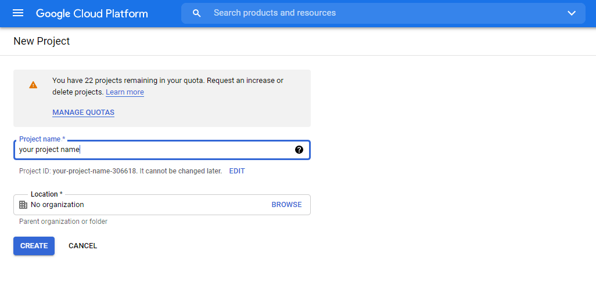
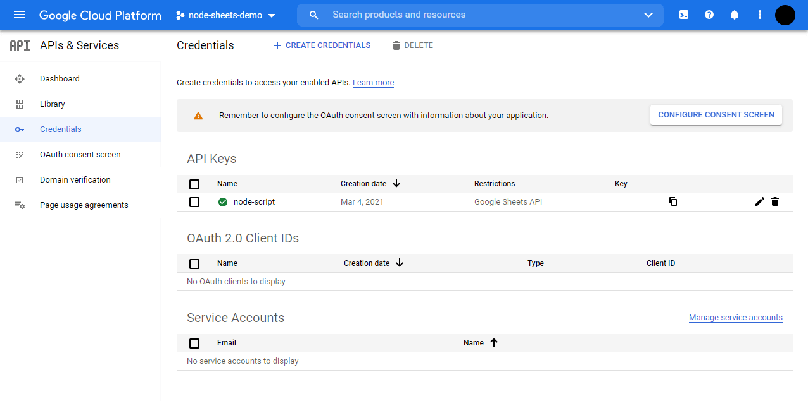

# node-sheets-demo

## Install Dependencies

```javascript
yarn add node-sheets dotenv
```

## Create Google API Key

You can generate your own API Key here:

1. Register here with your Google account and create a new project ["Google Developer Console"](https://console.developers.google.com/)



2. Then go in the "Credentials" tab create a new API Keys.



## Add the API Key to ENV

Remember to create a ".env" file with this content:

```
GOOGLE_SHEET_KEY=HERE_YOUR_API_KEY
```

## Run the script

To run this script run these commands

```javascript
yarn install
yarn dev
```
